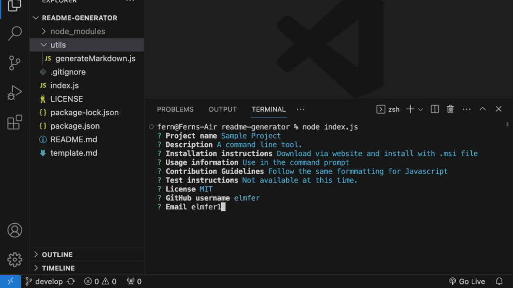

# Project Readme Generator

 
 
A command line interface tool that allows you to quickly create a professional README file for your next project. Easy to use with the help of the inquirer library. Fun fact, this README for this program is created by this program!

Walkthrough: 

 
## Table Of Contents
1. [Installation](#installation)
2. [Usage](#usage)
3. [License](#license)
4. [Contributing](#contributing)
5. [Tests](#tests)
6. [Questions](#questions)
 
### Installation
 
Make sure you have NodeJS v18.18.0 or greater installed on your system. Then clone this repository. Be sure to run `npm install` before doing anything to the project. Lastly, run `node index.js` to run the program.
 
### Usage
 
Upon running this program, you will be prompted with a series of questions regarding your new project including name, install instructions, and usage information. Once completed, the program will write to `out/README.md`. This is your newly generated README file that you can copy to your new project directory.
 
### License
 
 

This project in under the MIT license. Learn more about it here: https://opensource.org/licenses/MIT
 
### Contributing
 
A couple of rules if you kindly want to contribute. Write Javascript the same format as the rest of the project. Make your commits descriptive, outlining the steps you've taken when creating a feature. Lastly, upon making a pull request, ask to merge to the `develop` branch, not the main one. Thank you in advance for any contributions you make in the future!
 
### Tests
 
Not available at this time.
 
### Questions
 
What is the link to my GitHub?
 
- Link to my GitHub profile: [https://github.com/elmfer](https://github.com/elmfer)
 
How can you contact me?
 
- Contact me through my email: [elmfer10@gmail.com](mailto:elmfer10@gmail.com)
